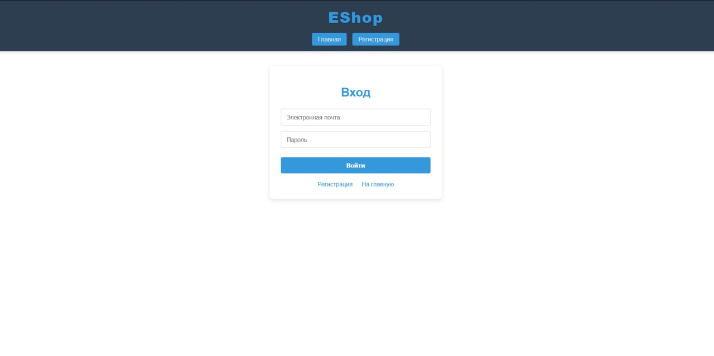
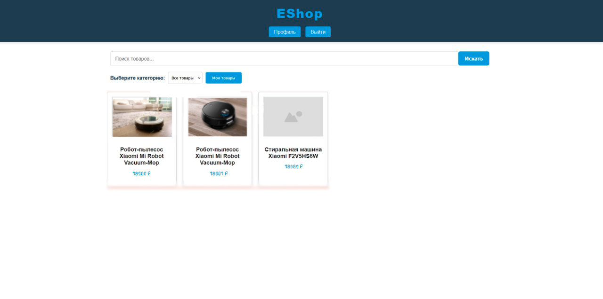
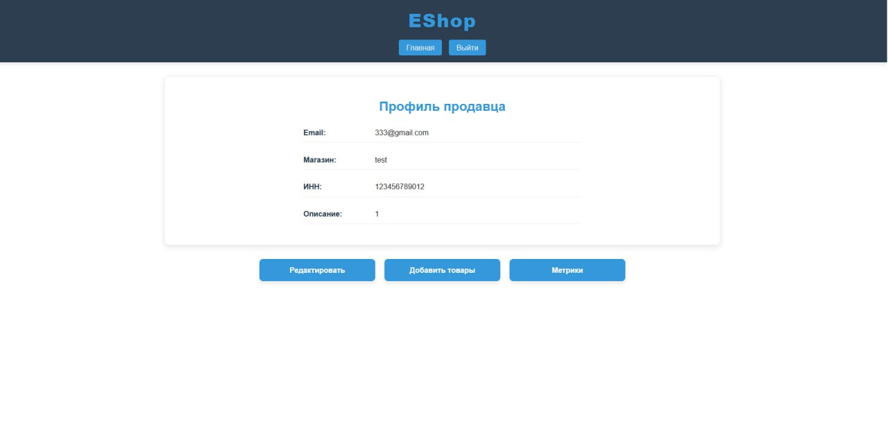
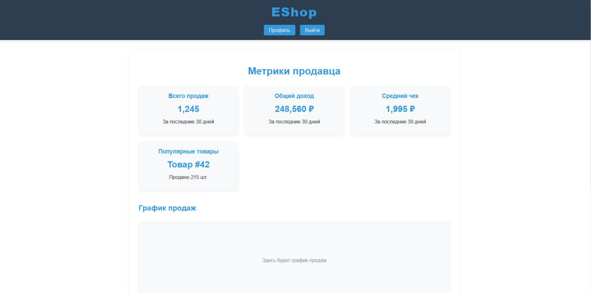
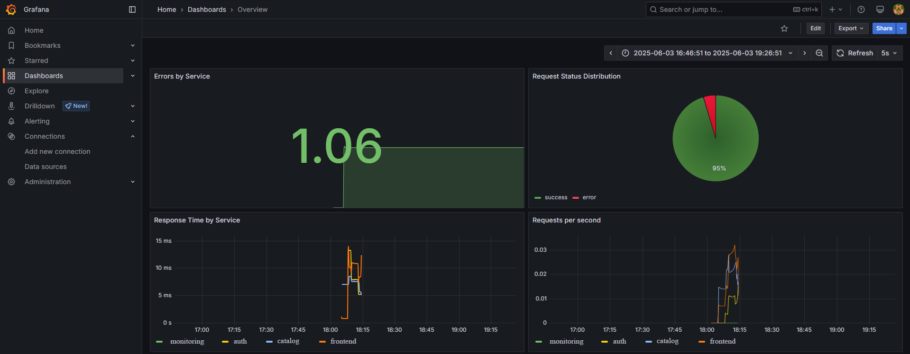
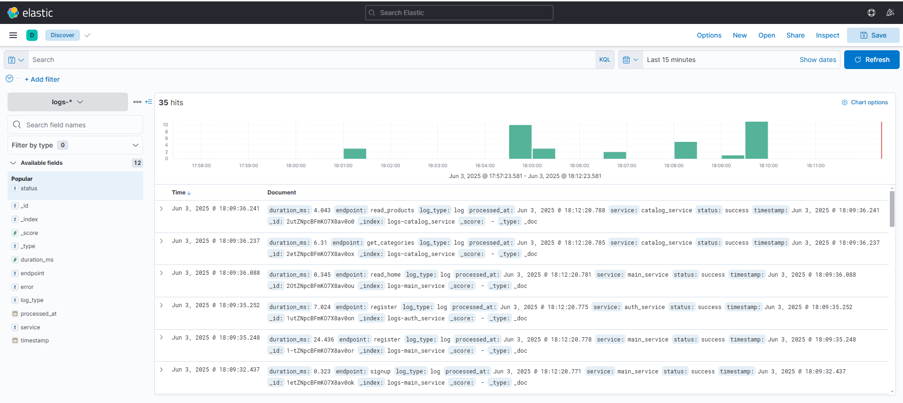
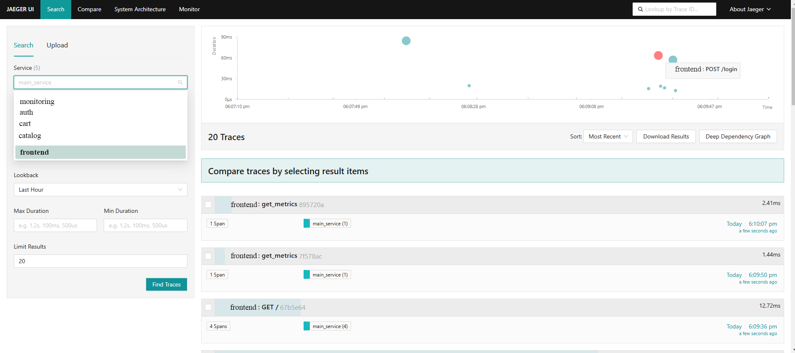

# EShop - Высоконагруженная E-commerce Платформа

## О проекте
EShop - это современная платформа электронной коммерции, построенная на микросервисной архитектуре. Система предназначена для обработки высоких нагрузок и предоставления аналитики в реальном времени.

### Основные функции
- Высокопроизводительный API на FastAPI
- Потоковая обработка данных через Kafka
- Эффективное хранение данных в PostgreSQL + Elasticsearch 
- Хранение файлов в Minio
- Полноценная система мониторинга
- Аналитика пользовательской активности в реальном времени

### Архитектурное решение

Микросервисная структура включает:

- **Auth**: Аутентификация и управление пользователями
- **Catalog**: Управление каталогом и поиск товаров
- **Cart**: Обработка корзин
- **Frontend**: Фронтенд
- **Monitoring**: Обработка аналитики

### Используемые технологии

- **Backend**: FastAPI (Python 3.10+)
- **Message Broker**: Apache Kafka
- **Databases**:
  - PostgreSQL (транзакционные данные)
  - Elasticsearch (поиск и аналитика)
  - Minio (хранение изображений)
- **Monitoring Stack**:
  - Prometheus + Grafana
  - Jaeger
  - Elasticsearch, Kibana


## Демонстрация работы

### Frontend





### Grafana Dashboard
Визуализация ключевых метрик производительности.



### Kibana Interface
Анализ и поиск по системным логам.



### Jaeger Tracing
Мониторинг взаимодействий между сервисами.




## Быстрый старт

### Требования
- Docker 20.10+
- Docker Compose 2.0+

### Установка

1. Клонирование репозитория либо скачивание архива

2. Запуск инфраструктуры:
```bash
docker compose up -d 
```

3. Доступ к сервисам:
- Фронтенд: http://localhost:8000
- Мониторинг: http://localhost:3000
- Логи: http://localhost:5601
- Трейсинг: http://localhost:16686
